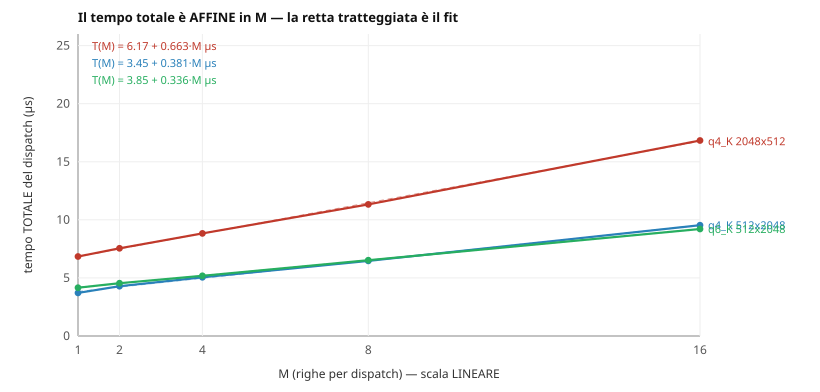
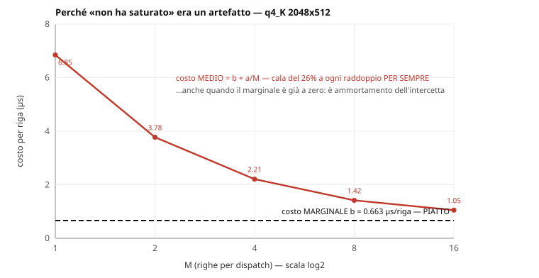
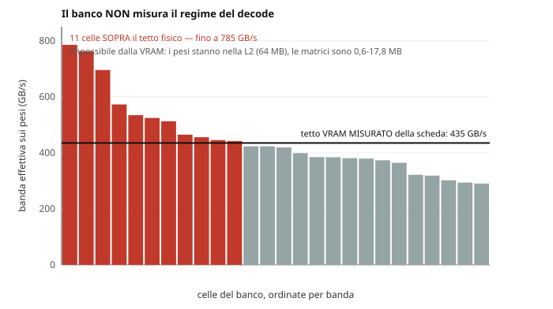
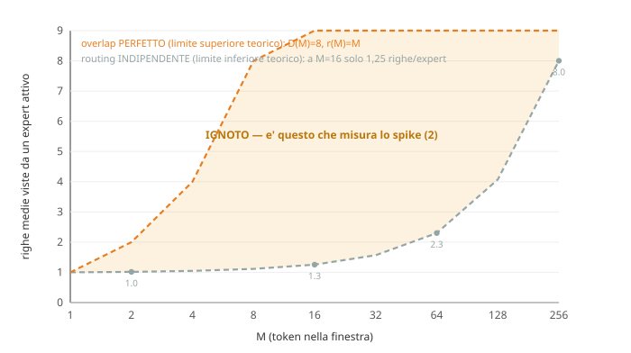

# Quanto vale processare più righe per dispatch? — la ricerca su `cost(M)`

**Goal**: `engine-velocita-decode`, spike (1) di tre.
**Date**: 2026-08-17 (prima misura) e 2026-08-18 (estensione e correzione).
**Artefatti**: `results/microbench/costm-decode-4090-linux-*.json`.
**Pre-registrazione**: `costm-decode-prereg-2026-08-17.md` — scritta prima di
vedere qualunque cella, con le previsioni e **cosa le falsifica**.
**Grafici**: rigenerabili con `python3 scripts/costm-charts.py`.

---

## 0. Il riassunto, per chi legge solo questo

1. Il ginocchio del costo per riga è a **M=2**, e questo **ribalta il verdetto
   «spec-dec più lento»** — che era corretto per i kernel su cui fu preso.
2. **Ma «la curva non ha ancora saturato a M=16» era un artefatto della
   metrica.** Il tempo totale è affine in M; il costo *medio* per riga cala del
   26% a ogni raddoppio **per sempre**, per pura aritmetica, anche a guadagno
   marginale zero. Il residuo oltre M=16 è **1,6x**, non un altro 30x.
3. **Il banco misura un regime che il decode non vive**: i pesi stanno nella L2,
   con celle a 785 GB/s contro un tetto VRAM di 435.
4. **Il segmento expert non può usare M grande per struttura**: con top-8 su 256
   ogni expert vede 4-6 righe anche a M=64.
5. L'unico consumatore reale di M>16 è il **prefill**, e il suo contratto è il
   **TTFT**.

---

## 1. La domanda, e da dove nasce

Lo spec-dec era **parcheggiato**: il checkpoint B l'aveva misurato **1,18× più
lento**. Quel verdetto poggiava su una proprietà dei kernel di allora —
`headroom §3.1` misurava M «quasi ininfluente, 1,22× a M=8», cioè la riga
marginale costava ~0,85 di un pass intero.

Sui kernel di oggi la proprietà è diversa. `wgsl.ts:4609` (banco fase 0 di
`engine-kquant`, shape [2048,4096]) misura `splitk-idot` a **M=16 in 0,0376 ms
contro 0,0698 a M=1**: sedici righe costano meno di una.

**La domanda**: dove si accende quella proprietà, e fino a dove arriva?

### Perché l'ammortamento dovrebbe esistere

A M=1 il GEMV quantizzato è **ALU-bound**, non memory-bound — e questo è
misurato, non assunto: il GEMV **f32** satura la banda della scheda (435 GB/s,
100% del picco misurato) mentre i **quantizzati stanno al 20%**. Il collo è il
costo aritmetico della dequantizzazione.

Il costo per peso è quindi ≈ `t_load + t_dequant + M·t_mac`: **dequant e traffico
pesi si pagano una volta per M righe**. Con `t_dequant ≈ 4·t_mac` il costo per
riga scala come `(4+M)/5M` → M=2 al 60%, M=4 al 40%, M=8 al 30%.

Questa formula è stata **pre-registrata**, non ricostruita a posteriori.

---

## 2. Metodo

- **Banco**: `src/microbench/ttKQuant.ts`, gemelli byte-per-byte dei generatori
  di produzione (`PREFILL_GEMM_PORT_DIFFS` è vuoto e un test lo verifica nelle
  due direzioni). **Non** si passa da `planPrefillGemm`, che su q4_K/q6_K/q8_0
  risponde `legacy` perché sono `wired: false`.
- **Shape**: quelle vere del decode del 35B — `q4_K 2048×512` (expert gate/up:
  117 tensori, 17,67 GB, il modello quasi tutto), `q4_K 512×2048` e
  `q6_K 512×2048` (expert down), `q8_0 2048×4096` (attn q-proj).
- **M**: `{1, 2, 4, 8, 16}` il 17, esteso a `{32, 64, 128, 256}` il 18.
- **Varianti**: `base-batch-z`, `base-decode`, `splitk-f32`, `splitk-idot`.
  Per ogni M si prende **il minimo fra le varianti** — confrontare kernel diversi
  a M diversi è l'errore che ha quasi capovolto la prima lettura (§7).
- **Protocollo**: 13 repliche per cella, warm-up scartato, misura interleavata,
  host dichiarato quiescente, `timestamp-query`.
- **Provenienza**: il runner **rifiuta di scrivere** un artefatto il cui tag non
  sia in `PROV` con goal e pre-registrazione. La prima run è morta lì.

---

## 3. Il risultato grezzo

Costo **per riga**, migliore variante per ogni M, normalizzato a M=1:

| shape | M=1 | M=2 | M=4 | M=8 | M=16 | M=32 | M=64 |
|---|---|---|---|---|---|---|---|
| q4_K 2048×512 gate/up | 100% | **60,8%** | 35,6% | 22,8% | **16,9%** ← min | 22,1% | 24,4% |
| q4_K 512×2048 down | 100% | **57,8%** | 34,1% | 21,8% | **16,1%** ← min | 18,6% | 21,7% |
| q6_K 512×2048 down | 100% | **54,6%** | 31,2% | 19,6% | 13,8% | 12,8% | **10,1%** ← min |
| q8_0 2048×4096 attn | 100% | **50,5%** | 27,5% | 14,2% | 9,0% | **7,6%** ← min | 12,0%* |

\* contaminato: `splitk-idot@M64` scartata per checksum (§8), il minimo cade su
una variante peggiore.

**Il modello pre-registrato prevedeva 60,0% a M=2. Misurato: 50,5-60,8%.**

> I valori sono quelli dell'artefatto **più recente** (2026-08-18, sweep esteso).
> La prima stesura di questa tabella mescolava le due run — differenze di qualche
> decimo, ma un documento che cita un artefatto deve riportare *quello*.

---

## 4. La scoperta che cambia la lettura: il tempo totale è affine

Il fit `T(M) = a + b·M` è **quasi esatto** — residuo massimo 0,027-0,143 µs su
valori di 4-22 µs:

| shape | intercetta `a` | marginale `b` |
|---|---|---|
| q4_K 2048×512 | 6,17 µs | 0,663 µs/riga |
| q4_K 512×2048 | 3,45 µs | 0,381 µs/riga |
| q6_K 512×2048 | 3,85 µs | 0,336 µs/riga |

Il costo **medio** per riga è `b + a/M`. Cioè:

> **Il costo medio cala del ~26% a ogni raddoppio di M per sempre**, per pura
> aritmetica dell'ammortamento dell'intercetta `a` — **anche quando il costo
> marginale è già a zero.**

Il «26% fra M=8 e M=16», che avevo letto come margine residuo da inseguire, è
**esattamente ciò che il modello affine predice quando il margine marginale è
nullo**. Non è evidenza di headroom: è la definizione di una media.

**Guadagno residuo da M=16 a M=∞**: `b/(b+a/16)` → **1,58× · 1,57× · 1,72×**.
Non un altro 30×. Il 30× era M=1→M=16, ed è già incassato.

### E la curva misurata torna su

Sulle due shape `q4_K` il minimo è a **M=16**: a M=32 e M=64 il costo per riga
**peggiora**. Il muro non è il workgroup storage (limite duro a M=153) né un
limite WebGPU — è l'**asintoto ALU/issue**. Sulle shape expert piccole `b` non è
nemmeno il tetto ALU della macchina: la griglia è di 2.048-8.192 thread su una
GPU che ne vuole ~100k, quindi `b` è il costo di issue di **un chip semivuoto**.

---

## 5. Il caveat che limita il trasferimento: i pesi stanno in L2

Alcune celle misurano fino a **785,5 GB/s effettivi sui pesi** — **1,8× il tetto
VRAM misurato di 435 GB/s**. È fisicamente impossibile leggendo dalla VRAM.

La spiegazione è banale una volta vista: le matrici del banco sono **0,59-17,8
MB** e la L2 dell'AD103 è **64 MB**. Ci stanno tutte, e il banco ripete 16
dispatch sulla stessa matrice.

**In produzione il decode streama 571 MB di pesi expert per token dalla VRAM.**
Quindi tutta la tabella §3 misura un regime che il decode **non vive**. I numeri
restano validi come *proprietà del kernel*; non si trasferiscono come *tempi del
motore* senza bracci a cache fredda (`-coldw`), che l'artefatto ha solo per q4_0
a M=16.

---

## 6. Il vincolo strutturale del MoE: chi può davvero usare M grande

Con **top-8 su 256 expert**, le M righe di una finestra si sparpagliano su
expert diversi. Righe medie viste da un expert *attivo* = `8M / E[#distinti]`.
Due limiti teorici, e in mezzo il vuoto:

- **routing indipendente** (limite inferiore): `E[#distinti] = 256·(1−(248/256)^M)`
  → a M=16 sono 102 expert distinti, cioè **1,25 righe per expert: ammortamento
  ~zero**;
- **overlap perfetto** (limite superiore): `D(M) = 8` costante → `r(M) = M`.

**Dove cada il valore vero sul 35B non lo sa nessuno**, e la forbice è enorme: a
M=2, `D=15,75` dà guadagno 1,01× mentre `D=10` dà **1,51×**. È precisamente
quello che misura lo **spike (2)**.

> ⚠️ **CORREZIONE (2026-08-18).** La prima versione di questo grafico disegnava
> una curva «routing correlato, stimato dal recall 82,67%». **Quel prior era
> sbagliato**: `q35-looka-run.mjs` predice il router del layer *l* dall'hidden
> **pre-attention della stessa posizione** — misura quanto l'attention sposta il
> routing *dentro un token*, e non dice nulla sull'overlap fra token adiacenti.
> Il prior giusto esiste ma altrove: `tools/oracle-moe/trace.cpp:9` ha già
> `baseline_prev`, «overlap top-4 tra posizioni decode consecutive» — misurato
> **solo su GLM**, mai sul 35B. La curva è stata rimossa e sostituita dalla
> banda fra i due limiti teorici.

### E c'è un secondo vincolo, che riguarda l'offerta e non la domanda

Anche con overlap perfetto, **la curva `T(M)` di questo documento oggi non si
applica al segmento expert**: il divieto `batch && arena` è per costruzione
(`wgsl.ts:2176-2190` — `batch` mette le righe su `wid.z`, e in regime d'arena
resta vietato), e il consuntivo `kquant §4.3` dichiara che per Q4_K/Q6_K il
braccio misurato al banco **non è il percorso di produzione**.

Quindi lo spike (2) misura la **domanda** (righe per expert raggiungibili); l'
**offerta** — un GEMM multi-riga che funzioni in regime d'arena — è un kernel da
scrivere. **Il risultato dello spike non è «quanto acceleriamo domani»: è «si
scrive o non si scrive quel kernel».**

---

## 7. Cosa questa ricerca ha sbagliato, e come se n'è accorta

Registrato perché il metodo conta quanto il risultato.

1. **Aggregare celle di shape diverse** ha prodotto una tabella in cui il q4_K
   gate/up *peggiorava del 229%* a M=2. Raggruppavo per famiglia sovrascrivendo
   con l'ultima variante vista. Con quella tabella la conclusione sarebbe stata
   «ammortamento assente, spec-dec resta parcheggiato». **Errore commesso due
   volte in due giorni**, la seconda derivando «72 B per riga» da una pendenza
   mista fra shape.
2. **Generalizzare il sorpasso di variante**: «a M=1 vince `base-batch-z`, da M=2
   `splitk-idot`» vale per **una shape su quattro**. Sulle altre tre
   `splitk-idot` vince già a M=1. Era la frase memorabile, cioè quella che
   sarebbe stata ricitata.
3. **Fermarsi a M=16 senza una ragione misurata**: la griglia veniva da
   `PREFILL_M = 16` di un altro goal. È stata estesa solo dopo che il PI l'ha
   chiesto — e l'estensione ha trovato il minimo e la risalita.
4. **Leggere la media invece del marginale**: l'errore concettuale più costoso, e
   quello che un fit avrebbe evitato al primo colpo. Il dato che lo smentiva —
   un M=32 sul q4_0 col costo per riga già in risalita — **era nell'artefatto dal
   primo run** e nessuno l'aveva letto.
5. **Un grafico sbagliato**: la prima versione della figura §4 disegnava il fit
   affine come una retta su un asse **log2**, dove una funzione affine non è una
   retta. Il fit sembrava pessimo mentre era quasi esatto. Asse portato a lineare.

---

## 8. Anomalie aperte

**Tre celle scartate per checksum**, tutte `q8_0/splitk-idot`, con errore che
**cresce con M** — tolleranza 2e-2:

| cella | shape | relDiff |
|---|---|---|
| `@M1` | K=512 N=2048 | 3,489e-2 |
| `@M64` | K=2048 N=4096 | 3,075e-2 |
| `@M128` | K=2048 N=4096 | **7,909e-2** |

Lo stesso kernel **passa** il ktest su GPU vera a maxRel 5,96e-4 su [2048,200]:
non è rotto in generale. Docket **item 26**, e diventa urgente proprio ora — se
il ginocchio a M=2 fa entrare `splitk-idot` nel decode, quella forma va in
produzione.

**Il banco non copre `q2_K`**, cioè il quant che consegniamo davvero (docket
item 24). Stesso generatore non è stessa geometria: il q2_K ha scale a 4 bit e
blocco più stretto, quindi cambia il rapporto byte/lavoro — che è esattamente
ciò che decide dove sta il ginocchio.

---

## 9. Conseguenze

**Sullo spec-dec.** Verificare 2 token costa **1,22×** un token solo sulla shape
peggiore (2 × 60,8%). Con accept 50% (1,5 token/passata): **1,23×**. Coi kernel
vecchi era `1,5/1,8 = 0,83×`, cioè l'1,18× più lento del checkpoint B. **Quel
verdetto era corretto per i suoi kernel ed è caduto perché la proprietà del
kernel è cambiata sotto di esso** — misura scaduta, non misura sbagliata.

Ma è il **banco**: 1,24× è il permesso di misurare nel motore, non il risultato.
E vale per il segmento denso finché lo spike (2) non dice quanto vale sul MoE.

**Su M grande.** Non serve al decode. L'unico consumatore reale è il **prefill**
(M = token del prompt, centinaia), e il contratto che ne beneficia è il **TTFT**.
Il deliverable di una misura oltre M=16 è «di quanto alzare `PREFILL_M`».

**Sui tier di dispositivo** (docket item 28). La curva `cost(M)` non è «scegli un
M»: è la **tabella di selezione per tier**. Un device che concede 49 KB di
workgroup storage esegue la variante a M più alto, uno al minimo di spec (16 KB)
quella a M=32, uno a 8 KB una più piccola. Il minimo di spec è il **pavimento del
portafoglio, non il suo tetto**. Il meccanismo esiste già per l'80%:
`gpulimits.ts` negozia `min(adapter, requisito)`, `gpudevice.ts` filtra le
feature per quelle realmente presenti, `gemvcaps.ts` è il gate di capability.
Manca la selezione di M per tier, prevista all'impacchettamento delle API.
