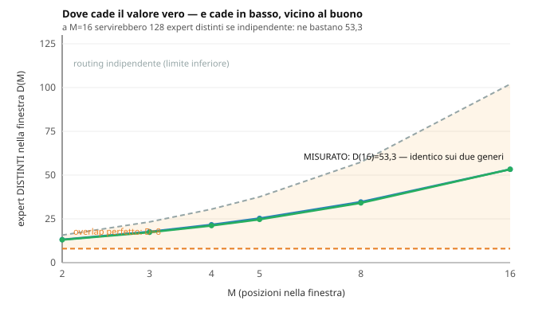
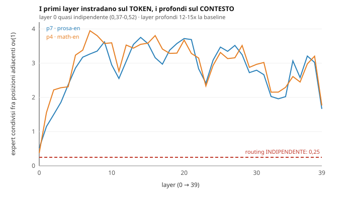

# Quanto è correlato il routing fra posizioni adiacenti? — spike (2)

**Goal**: `engine-velocita-decode`, spike (2) di tre.
**Data**: 2026-08-18.
**Strumento**: `scripts/q35-router-overlap-run.mjs` (nuovo), cpuref-f64, 40 layer.
**Artefatti**: `results/engine/q35-router-overlap-35b-p{7,4}-2026-08-18.json`.
**Precede**: `costm-ricerca-2026-08-18.md` (spike 1), che fornisce `A` e `B`.

---

## 0. Il risultato in tre righe

Il routing è **correlato 11-12 volte** la baseline dell'indipendenza. Ne segue un
guadagno sul segmento expert di **1,19× a M=2**, che sale a 2,11× a M=16. E la
**banda di genere è sotto l'1%**: il numero è una proprietà del modello, non del
testo.

---

## 1. Perché la domanda esisteva

Lo spike (1) ha misurato che il costo di un GEMM multi-riga è **affine in M**:
`T(M) = a + b·M`. Il guadagno viene dal consolidare il termine fisso `a`.

Ma su un MoE le M righe di una finestra **si sparpagliano su expert diversi**.
Con top-8 su 256, se il routing di posizioni adiacenti fosse indipendente
l'atteso sarebbe `8·8/256 = 0,25` expert condivisi: a M=2 si avrebbero ~15,75
expert distinti per 16 selezioni, cioè **~1,02 righe per expert e ammortamento
zero**. La curva dello spike (1) non si applicherebbe affatto al segmento che
pesa di più.

### Il prior che avevo citato era sbagliato

Avevo scritto che il recall **82,67%** dell'oracolo di lookahead fosse evidenza
di correlazione. **Non lo è**: `q35-looka-run.mjs` predice il router del layer
*l* dall'hidden **pre-attention della stessa posizione** — misura quanto
l'attention sposta il routing *dentro un token*, e non dice nulla sull'overlap
*fra* token.

Il prior giusto esisteva altrove e nessuno l'aveva applicato al 35B:
`tools/oracle-moe/trace.cpp:9` ha `baseline_prev`, «overlap top-4 tra posizioni
decode consecutive» — misurato **solo su GLM** (64 expert, top-4).

---

## 2. Metodo

- **Metrica primaria**: `D(M)`, gli expert **distinti nell'unione** di una
  finestra di M posizioni, misurato **direttamente su finestre scorrevoli**.
  L'overlap a coppie `ov(d)` è tenuto come *diagnostico del decadimento*, non
  come metrica: **non ricostruisce `D(M)`** (l'inclusione-esclusione vorrebbe i
  termini di ordine superiore).
- **Set grezzi, non metriche**: si logga il top-8 per (prompt, posizione, layer).
  Le metriche si ricalcolano, i set no.
- **Separazione modello/corpus**: un testo ripetitivo alza l'overlap, e si
  misurerebbe il corpus. Il controllo è la **baseline a lunga distanza** nello
  stesso prompt (coppie a `d ≥ 64`): quella è la componente stazionaria/topica, e
  l'**eccesso** a `d` piccolo è la correlazione locale del modello.
- **Corpus**: due prompt **interi** del golden — p7 (`08-prosa-en`, 269 pos) e p4
  (`05-math-en`, 388 pos). Regola full-corpus del progetto: esplorazione = subset
  di prompt interi, mai un cap sulle posizioni.
- **Escluso**: lo shared expert, che è sempre attivo e già batchato nel segmento
  statico. Includerlo gonfierebbe l'overlap di un termine certo.

---

## 3. Il risultato

| | ov(1) | ov(2) | ov(3) | ov(4) | ov(64) |
|---|---|---|---|---|---|
| p7 · prosa-en | **2,83** | 2,07 | 1,99 | 1,91 | 1,37 |
| p4 · math-en | **2,95** | 2,42 | 2,21 | 2,03 | 1,28 |
| *indipendente* | *0,25* | | | | |

### La separazione modello/corpus ha funzionato

Sul p7, dell'overlap 2,83 a distanza 1: **1,37 è componente topica** (lo stesso
testo attiva gli stessi expert a qualunque distanza) e **1,46 è correlazione
locale del modello**. Circa metà e metà. E l'eccesso locale **dimezza già a
d=2** (+1,46 → +0,70): è concentrato sui vicini immediati, che è precisamente il
regime dello spec-dec.

### D(M): dove cade il valore vero



| M | D(M) p7 | D(M) p4 | righe/expert | **G(M)** |
|---|---|---|---|---|
| 2 | 13,2 | 13,1 | 1,22 | **1,190× / 1,199×** |
| 4 | 21,7 | 21,2 | 1,48 | 1,411× / 1,441× |
| 8 | 34,7 | 34,1 | 1,84 | 1,704× / 1,729× |
| 16 | 53,3 | **53,3** | 2,40 | 2,112× / 2,112× |

`G(M) = 8M(A+B) / [D(M)·A + 8M·B]`, con `A = 15,79 µs` e `B = 1,707 µs/riga`
dallo spike (1). **Sanity**: con routing indipendente `D = 8M` e `G = 1` esatto —
tutto il guadagno sta nel consolidamento del termine fisso `A`.

### La banda di genere è sotto l'1%

`G(2)` va da **1,190×** a **1,199×** fra prosa inglese e matematica, e `D(16)` è
**identico** (53,3). Nel frattempo la baseline *topica* differisce (1,37 contro
1,28): **i due testi hanno stazionarietà diversa ma la struttura del routing è la
stessa**. È la lettura che la baseline a lunga distanza doveva permettere.

---

## 4. Il fatto più grosso, e non era nel disegno



```
ov(1) per layer:  p7  da 0,52 a 3,75      p4  da 0,37 a 3,95
```

**Il layer 0 è praticamente indipendente** (0,37-0,52 contro 0,25 teorico), i
layer profondi sono correlati **12-15×** la baseline. L'ipotesi che lo spiega: i
primi layer instradano sul **token**, i profondi sul **contesto** — che fra
posizioni adiacenti è stabile.

**Conseguenza pratica, non nel contratto di nessuna riga**: un GEMM multi-riga in
arena renderebbe **molto di più sui layer profondi**, e una politica che lo
accende solo sopra una soglia di layer prenderebbe quasi tutto il guadagno a metà
del costo di implementazione.

---

## 5. Cosa questa misura NON dice

- **È il PREFILL.** Sono posizioni adiacenti del prompt, non token generati, e le
  finestre spec-dec vivono nel decode. Il decode teacher-forced dei 128 token
  golden è un'aggiunta da ~5 min per prompt.
- **Misura la DOMANDA, non l'offerta.** Il divieto `batch && arena`
  (`wgsl.ts:2176-2190`) è per costruzione, e il consuntivo `kquant §4.3` dichiara
  che per Q4_K/Q6_K il braccio misurato al banco non è il percorso di produzione.
  **Il GEMM multi-riga in regime d'arena è un kernel da scrivere**: questo numero
  decide *se* si scrive, non quanto acceleriamo domani.
- **Due prompt non sono una legge.** La banda strettissima è incoraggiante ma
  poggia su due punti.
- **Combina due regimi.** `A` e `B` vengono da un banco **L2-resident**; `D(M)`
  dal cpuref. Il caveat taglia a favore — in streaming il termine fisso per
  expert *cresce* (+1,8-2,3 µs), e più `A` è grande più consolidare rende — ma è
  un'inferenza, non una misura.

---

## 6. Conseguenza

Sul segmento expert: **1,19× a M=2**, sopra l'**1,23×** che lo spike (1) ha
misurato sul lato kernel. Il segmento expert è la quota dominante del token in
streaming (571 MB per token).

**La raccomandazione è che il GEMM multi-riga in arena valga la scrittura.** È
spesa, e la decisione è del PI: docket **item 29**.
